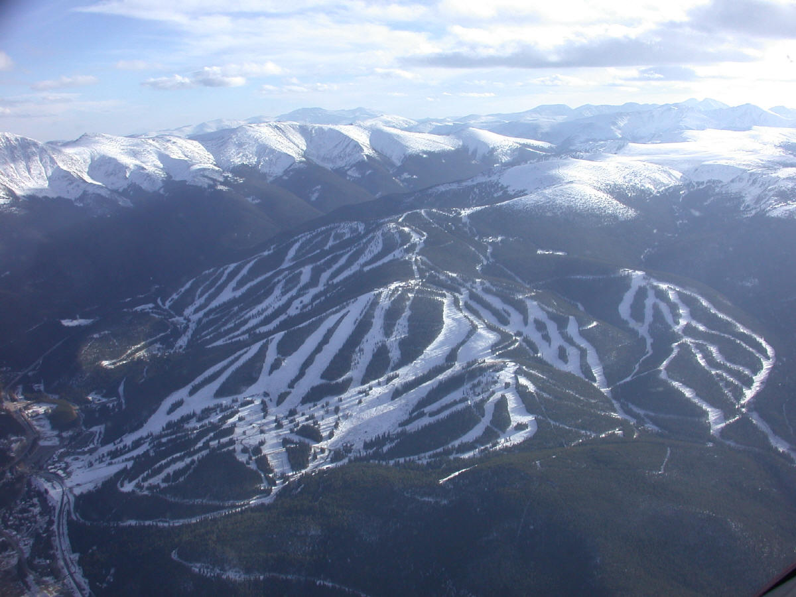
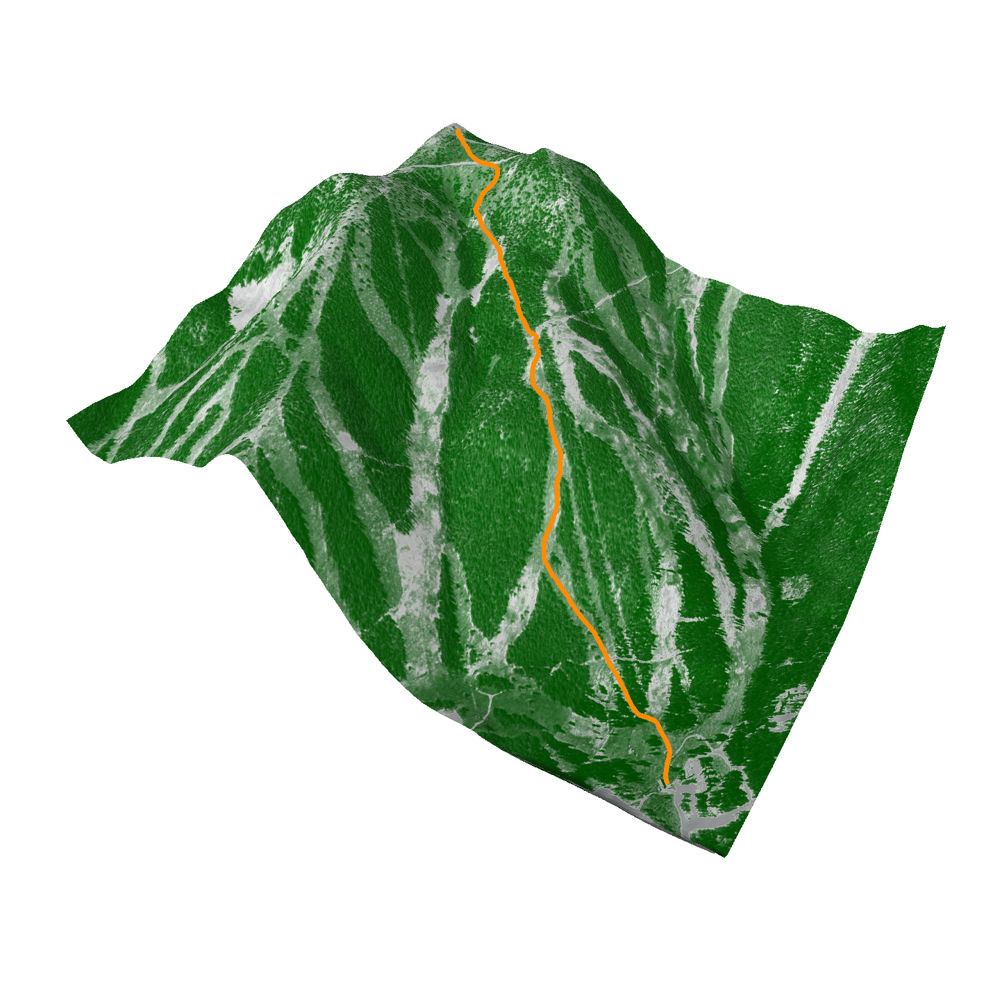
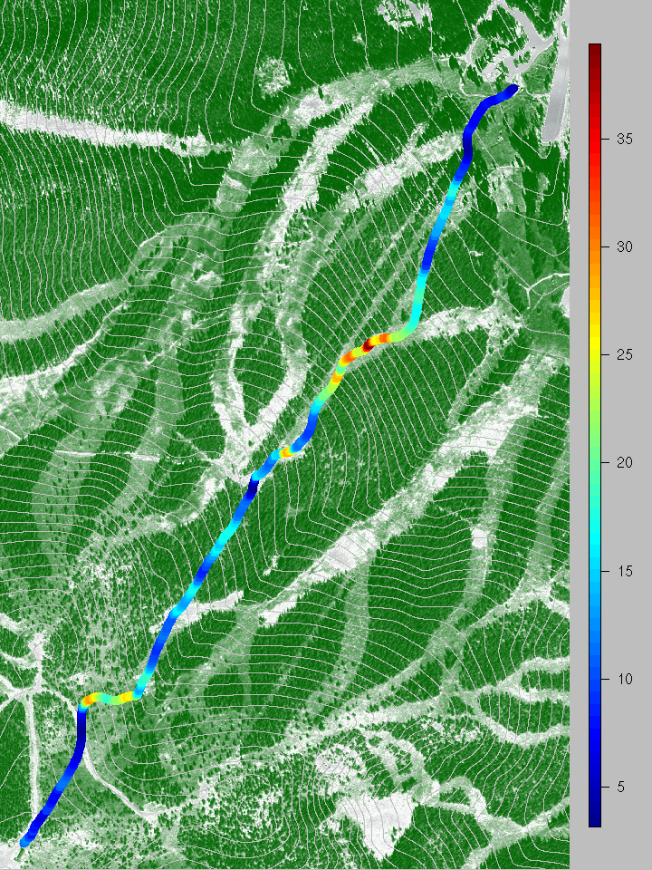

<h2>Digital Elevations and Digital Orthophoto fields for The Mary
Jane Ski Resort</h1>

<h2>  <a href="https:/dnychka.github.io"> Doug Nychka </a>   

 </h2>

 

These data form the basis for a extended example using the
fields package for fitting and manipulating curves and surfaces. Refer to the<a href="./Data/MJposter.pdf"> poster</a>, presented at the
Joint Statistical Meetings of the American Statistical Association 2007 for more details on the statistics. In particular this is the first substantial application of the <a href="https:/guthub.NCAR/LatticeKrig"> LatticeKrig </a>
R package.  The
three data components for this example are georeferenced from the
WinterPark Mary Jane Ski resort in Colorado and centered around the
Super Gauge lift and Riflesight notch ski trial.  

<h2> Mary Jane Project</h2>
The Mary Jane Project (MJP)
is a web based guide for the primary ungroomed trails
at Winter Park/Mary Jane ski resort. This page provides some
quantitative analysis of one run that is part of the MJP.  

We would like to acknowledge Allie Nychka from MJProject for sharing her
broad knowledge on the ski area.
 

<a href="http://www.image.ucar.edu/Data/MJProject/narrative.html"> 
<h2> Narrative </h2>
</a>
<ul>
  <li><a href="narrative.html#motivation">Motivation</a>
  </li>
  <li><a href="narrative.html#guide">Guide to the run</a>
  </li>
  <li>  <a href="narrative.html#work">Some other work</a>
  </li>
</ul>

<h2> Data sets</h2>

The R datasets and supporting functions are contained in the R binary
format file <a href="./Data/RifleSight.rda"> <b>MaryJane.rda</b> 
</a>. 
(just download this file -- don't let your browser try to display it!)

  
<li>Digitial elevation model (DEM) on a 146X196 grid.
Elevations in meters with an approximate grid spacing of 10m.
 R data set name is RifleDEM.
     This image  was extracted
 from a  larger  DEM  that
 covers  Winter  Park and  Berthoud
 Pass. </li>

  <li>
    
  Digital orthophoto on a 1155X2003
grid.  Range of grey levels is 5 to 254. R dataset name is RifleImage.
 Detailed <a href="./Data/MJProject/photometa.html"> meta
data </a> provided with the download
describes the process and accuracy of
this image. The raw image is in
tiff format. This was converted to pnm format and
then read into R using the pixmap
package.  
    <b>RifleE</b> is a simple bilinear interpolation of the DEM elevations
to  the finer image grid created in fields using <b> interp.surface.grid</b>
    

  </li>

  <li>
    

    
Riflesight trail. Using the locator function
a skiing run  was input beginning at the top of the Super gauge
lift, dropping down Sluice Box (aka Juice Box by R. Lund), continuing under the lift to
      Riflesight, emptying out on Feebleminded to 
 finish at Super Gauge lift.  RifleI is matrixwith
400 lon/lat locations describing the run and rifle.trail.elev are the
interpolated elevations in meters. See the
 <a href="./Data/MJTrailMap.jpg">Trail Map</a> for what skiers
typically use to navigate. 

   
  </li>
</ul>

Both image datasets were obtained through the USGS seamless data
distribution service. These images are in standard R image list format with
components  x 
the grid values for longitude,  y the grid for
latitudes and z a
matrix of values.  

Additional components are 

<ul>
  <li>
  
  two.colors, MJ.colors: 
   Useful
color table functions for converting grey scale from white to
green. </li>

  <li>fig3.RifleSight:
       R function  for  perspective figure
       of image with ski run superimposed.</li>

  <li>trail.degrees:
    Estimated slope in degrees of the run based on the
                   DEM's and spatial analysis.</li>

  <li>fig4.RifleSight:
    R function  for image plot of photo with
slopes of run and elevation contours</li>

  <li>fields.style:
Some default sizes for characters and colors for the figures</li>

</ul>

|fig3.RifleSight|fig4.RifleSight|
|---------------------------------|------------------------------|
| |  |
| | (Ski run from  Lower left to upper right)|

  <h2>
<a href="./Rcode.html">More detailed data analysis including Kriging using R  and
fields</a>
</h2>

<h2>DISCLAIMER:</h2>

The data sets, software and related content in and linked to these pages
   are intended for scientific and mathematical research. The authors do not
   guarantee the correctness of the data, software or companion text.
  
